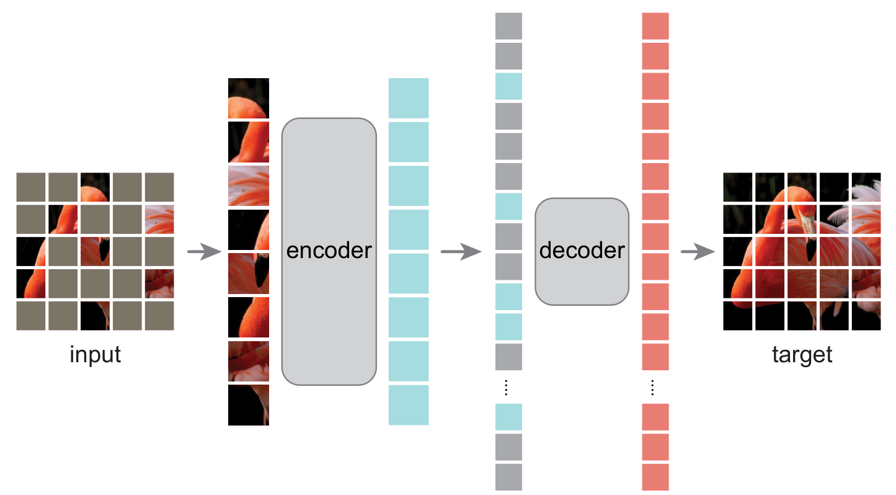

# Masked Autoencoder Pretraining

PyTorch reimplementation of ["Masked Autoencoders Are Scalable Vision Learners"](https://arxiv.org/abs/2111.06377v3).

<p align="center">

</p>

### Requirements
- Python 3.8+
- `pip install -r requirements`

### Usage
To pretrain a ViT-b/16 network run:
```
python train.py --accelerator gpu --devices 1 --precision 16  --data.root path/to/data/
--max_epochs 1000 --data.batch_size 256 --model.encoder_name vit_base_patch16
```
- Run `python train.py --help` to get descriptions for all the options.
- `--model.encoder_name` can be one of `vit_tiny_patch16, vit_small_patch16, vit_base_patch16, vit_large_patch16, vit_huge_patch14`.

